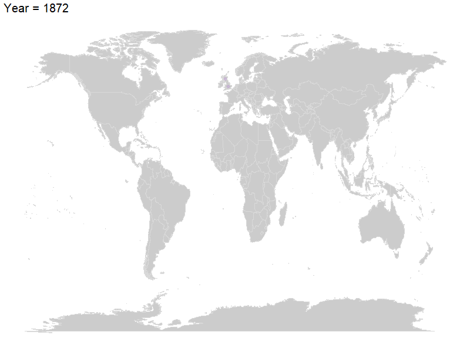

```r
library(ggplot2)
library(dplyr)
library(DT)
library(maps)
library(ggthemes)
library(plotly)
library(tibble)
library(lubridate)
library(gganimate)
library(readr)
library(ggmap)
library(animation)
```


```r
head(df)
```
|date|home_team|away_team|home_score|away_score|tournament|city|country|neutral|
| -------------| -------------| -------------| -------------| -------------| -------------| -------------| -------------| -------------|
|1872-11-30|Scotland|England|0|0|Friendly|Glasgow|Scotland|FALSE|
|1873-03-08|England|Scotland|4|2|Friendly|London|England|FALSE|


